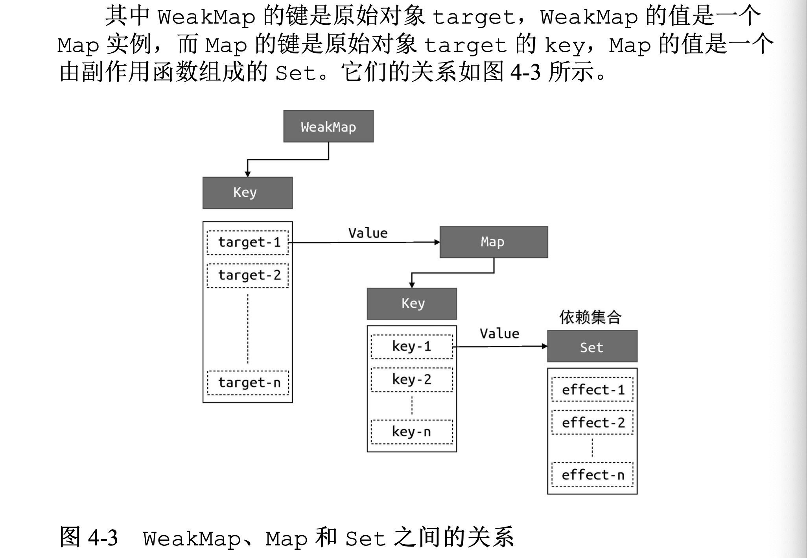

# 权衡的艺术
1. 声明式和命令式的差异
    - 命令式关注过程  声明式关注结果
    - 命令式理论上可以做到极致，但是用户需要承担更大心智的负担。
    - 声明式减少用户心智负担，损害一定的性能，但是框架开发者需要尽量让性能损失减到最小。
2. 虚拟dom的性能
    - 声明式的更新性能损耗 =  找到差异的性能损耗  + 直接修改的性能损耗
    - 虚拟dom的意义在让 找到差异的性能损耗降到最小。
    - 原生js操作dom(document.createElement)  虚拟dom   innerhtml 操作页面的性能，和 页面大小  更新页面大小 
    - 结合 心智负担 可维护性 最终选择虚拟dom。

* 运行时
* 编译时    
# 框架设计的核心要素
# Vue3设计思路
1. Vue.js是一个声明式的框架, 模版 虚拟dom
2. 渲染器 把虚拟dom对象渲染为真实dom元素。 它的工作原理是,递归地遍历虚拟dom对象,并调用原生dom api 来完成真实dom创建。 diff算法找出变更。
3. 组件的本质 组件其实就是一组虚拟dom元素的封装,它可以是一个返回虚拟dom的函数,也可以是一个对象,但是这个对象下必须有一个函数用来产出组件要渲染的虚拟dom。渲染器在渲染组件时,会先获取组件要渲染的内容，即执行组件的渲染函数并得到其返回值 subtree,最后再递归地调用渲染器将subtree渲染出来即可。
4. Vue.js的模版会被一个叫做编译器的程序编译为渲染函数。

# 响应式系统
1. 响应系统的作用与实现
2. 非原始值的响应式方案
3. 原始值的响应式方案

* Proxy  Reflect effect  track trigger   WeakMap 数据结构
    - effect  effectFn()  
    - effect cleanup   activeEffect.deps.push(deps)   set 会先触发 get 然后再触发 set
    - effect effectStack 嵌套effect
    - effect scheduler  trigger -> scheduler(effect)  jobQueue.add(fn)     flushJob() 
    - computer  watcher  flush  

    - 非原始值  
* 拓展运算符
* 如上面的代码所示，首先创建一个响应式的数据对象 obj，然后 使用展开运算符得到一个新的对象 newObj，它是一个普通对象，不具 有响应能力。这里的关键点在于，副作用函数内访问的是普通对象 newObj，它没有任何响应能力，所以当我们尝试修改 obj.foo 的值 时，不会触发副作用函数重新执行。



```
const map = new Map();
const weakmap = new WeakMap();

(function(){
    const foo = { foo:1 };
    const bar = { bar:2 }
    map.set(foo,1);
    weakmap.set(bar,2)
})()


```

* 简单地说 WeakMap 对 key 是 弱引用,不会影响垃圾回收器的工作。据这个特性可知，一旦 key被垃圾回收器回收，那么对应的键和值就访问不到了。所以WeakMap经常用于存储那些只有当key所引用的对象存在时才有价值的信息。 如果 target对象没有任何引用了，说明用户侧不再需要它了，垃圾回收器会完成回收任务。

* Proxy  track trigger   WeakMap Map  Set
* 分支切换 cleanup
* 嵌套的effect 与 effect栈。
* 避免无限递归循环
* 调度执行    
    - 当trigger动作触发副作用函数重新执行时,有能力决定副作用函数执行的时机 次数以及方式。
    - effect函数注册副作用函数时，可以传递第二个参数 options 它是一个对象,其中允许指定 scheduler调度函数，同时在effect函数内部我们需要把options选项挂载到对应的副作用函数上。
    - scheduler 在每次调度执行时,先将当前副作用函数添加到 jobQueue队列中,再调用 fulushJob函数刷新队列
    - fulushJob  isFlushing标志判断是否需要执行
* 计算属性与lazy


* 用全局变量 activeEffect 来存储通过 effect函数注册的 副作用函数,这意味着同一时刻 activeEffect所存储的副作用函数只能有一个。当副作用夯实发生嵌套时，内层副作用函数的执行会覆盖activeEffect的值，并且永远不会恢复到原来的值。这时如果再有响应式数据进行依赖收集,即使这个响应式数据在外层函数读取的,它们收集到副作用函数也都会是内层副作用函数。
* 副作用函数栈 effectStack  在副作用函数执行时，将当前副作用函数压入栈中，待副作用函数执行完毕将其从栈中弹出,并始终让 activeEffect指向栈顶的副作用函数。这样就能做到一个响应式数据只会收集直接读取其值的副作用函数,而不会出现相互影响的情况。

target 新增数据？  Proxy  curd?


# 非原始值的响应式方案
* Proxy Reflect的使用
* Proxy只能代理 对象。 且只能代理对象的基本操作。 例如 读取 设置，但是 obj.fn() 复合操作。
* Reflect    receiver
* 创建代理对象时指定的拦截函数，实际 上是用来自定义代理对象本身的内部方法和行为的，而不是用来指定 被代理对象的内部方法和行为的


# 原始对象
* 拓展运算符(...)

```
const obj = reactive({ foo: 1, bar: 2 })
return {
    ...obj
}

// 其实是返回 普通对象
return {
    foo:1,
    bar:2
}
```

* toRef      newObj 与  obj 字段相同 且在内部 set get 其实是调用 obj


# 渲染器
1. 渲染器的设计 
2. 挂载与更新 
3. 简单Diff算法 
4. 双端Diff算法 
5. 快速Diff算法
# 编译器
1. 编译器核心技术概览 
2. 解析器
3. 编译优化